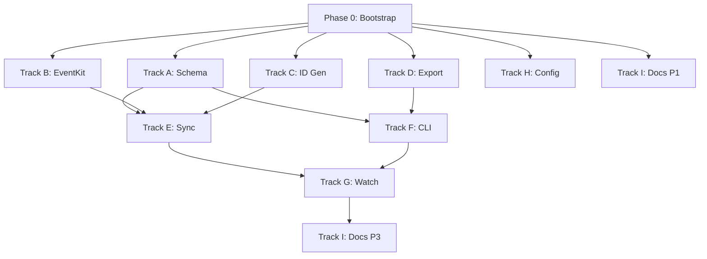

# Calendar Module Foundation - Tasks

## Execution Model

This task list is organized into **parallel tracks** designed for multi-agent execution. Each track operates on isolated files/modules to prevent merge conflicts.

```
Phase 1 (Parallel)     Phase 2 (Parallel)      Phase 3 (Sequential)
┌─────────────────┐    ┌─────────────────┐     ┌─────────────────┐
│ Track A: Schema │───▶│ Track E: Sync   │────▶│ Track G: Watch  │
└─────────────────┘    └─────────────────┘     └─────────────────┘
┌─────────────────┐           │
│ Track B: EventKit│──────────┤
└─────────────────┘           │
┌─────────────────┐           │
│ Track C: ID Gen │───────────┘
└─────────────────┘    ┌─────────────────┐
┌─────────────────┐    │ Track F: CLI    │
│ Track D: Export │───▶│ (uses A, D)     │
└─────────────────┘    └─────────────────┘
┌─────────────────┐
│ Track H: Config │ (Independent)
└─────────────────┘
┌─────────────────┐
│ Track I: Docs   │ (Independent)
└─────────────────┘
```

---

## PHASE 0: Bootstrap (Sequential Prerequisite)

> **BLOCKING**: Must complete before any parallel tracks begin.
> **Files**: `Package.swift`

- [ ] 0.1 Add GRDB.swift dependency to Package.swift
- [ ] 0.2 Add ICalendarKit dependency to Package.swift
- [ ] 0.3 Add RWMRecurrenceRule dependency to Package.swift (optional, for offline RRULE expansion)
- [ ] 0.4 Verify dependencies resolve and project builds

---

## PHASE 1: Parallel Foundation Tracks

### Track A: Database Schema & Models
> **Files**: `Sources/SwiftEAKit/Modules/CalendarModule/CalendarDatabase.swift`, `CalendarModels.swift`
> **Dependencies**: Phase 0 complete
> **No conflicts with**: Tracks B, C, D, H, I

- [ ] A.1 Create `CalendarModels.swift` with Codable structs:
  - `StoredCalendar`, `StoredEvent`, `StoredAttendee`, `StoredReminder`
  - `CalendarSyncStatus`, `StoredEventIdentity`
- [ ] A.2 Create `CalendarDatabase.swift` using GRDB `DatabaseQueue`
- [ ] A.3 Define `calendars` table (id, eventkit_id, title, source_type, color, is_subscribed, is_immutable, synced_at)
- [ ] A.4 Define `events` table with research updates:
  - Multi-ID columns: `id`, `eventkit_id`, `external_id`
  - UTC timestamps: `start_date_utc`, `end_date_utc`, `start_timezone`, `end_timezone`
  - Recurrence: `recurrence_rule`, `master_event_id`, `occurrence_date`
- [ ] A.5 Define `attendees` table (id, event_id, name, email, response_status, is_organizer, is_optional) with CASCADE delete
- [ ] A.6 Define `reminders` table (id, eventkit_id, calendar_id, title, notes, due_date, priority, is_completed, completed_at, synced_at)
- [ ] A.7 Define `sync_status` table (key, value, updated_at)
- [ ] A.8 Add optimized indexes:
  - `idx_events_date_range` (calendar_id, start_date_utc, end_date_utc)
  - `idx_events_external_id` (WHERE external_id IS NOT NULL)
  - `idx_events_master` (WHERE master_event_id IS NOT NULL)
  - `idx_events_updated` (updated_at)
- [ ] A.9 Add FTS5 with `synchronize(withTable:)` pattern
- [ ] A.10 Implement `DatabaseMigrator` with versioned migrations
- [ ] A.11 Add `#if DEBUG eraseDatabaseOnSchemaChange` for development
- [ ] A.12 Add unit tests for schema creation and migrations

---

### Track B: EventKit Data Access Layer
> **Files**: `Sources/SwiftEAKit/Modules/CalendarModule/CalendarDataAccess.swift`
> **Dependencies**: Phase 0 complete
> **No conflicts with**: Tracks A, C, D, H, I

- [ ] B.1 Create `CalendarDataAccess.swift` with singleton `EKEventStore`
- [ ] B.2 Implement permission request with macOS version check:
  - macOS 14+: `requestFullAccessToEvents()`
  - Earlier: `requestAccess(to: .event)`
- [ ] B.3 Implement `@MainActor` hop after permission callbacks
- [ ] B.4 Implement permission error handling with user guidance (System Settings path)
- [ ] B.5 Implement calendar discovery with Siri Suggestions filter
- [ ] B.6 Implement event query by date range (let EventKit expand recurrences)
- [ ] B.7 Implement multi-ID extraction:
  - `eventIdentifier` (fast local lookup)
  - `calendarItemExternalIdentifier` (stable, may be nil)
  - `calendarIdentifier` (calendar-level)
- [ ] B.8 Implement attendee extraction with `is_optional` field
- [ ] B.9 Implement reminder query (read-only)
- [ ] B.10 Add Info.plist keys for calendar access descriptions
- [ ] B.11 Add unit tests for permission handling with mocks

---

### Track C: Stable ID Generation
> **Files**: `Sources/SwiftEAKit/Modules/CalendarModule/CalendarIdGenerator.swift`
> **Dependencies**: Phase 0 complete
> **No conflicts with**: Tracks A, B, D, H, I

- [ ] C.1 Create `CalendarIdGenerator.swift` with multi-ID strategy
- [ ] C.2 Create `StoredEventIdentity` struct with all three IDs
- [ ] C.3 Implement public ID selection: prefer `calendarItemExternalIdentifier` when non-nil
- [ ] C.4 Implement fallback hash: SHA-256(calendar_id + summary + start_time)
- [ ] C.5 Implement recurring event ID: combine UID with `occurrenceDate`
- [ ] C.6 Implement ID reconciliation logic (pure function for sync to use)
- [ ] C.7 Add unit tests for ID generation consistency
- [ ] C.8 Add unit tests for ID reconciliation scenarios

---

### Track D: Export Formats
> **Files**: `Sources/SwiftEAKit/Modules/CalendarModule/CalendarExporter.swift`
> **Dependencies**: Phase 0 complete, Track A models (can use local copy)
> **No conflicts with**: Tracks A, B, C, H, I

- [ ] D.1 Create `CalendarExporter.swift` protocol and implementations
- [ ] D.2 Implement Markdown export with YAML frontmatter (Obsidian-compatible)
- [ ] D.3 Implement JSON export with ClaudEA-ready envelope structure
- [ ] D.4 Implement ICS export using ICalendarKit (RFC 5545)
- [ ] D.5 Implement UTC-to-local timezone conversion for display
- [ ] D.6 Implement attendee inclusion in all formats
- [ ] D.7 Add unit tests with mock event data

---

### Track H: Configuration
> **Files**: `Sources/SwiftEAKit/Modules/CalendarModule/CalendarConfig.swift`, VaultConfig extensions
> **Dependencies**: None (can start immediately)
> **No conflicts with**: All other tracks

- [ ] H.1 Create `CalendarConfig.swift` with config keys
- [ ] H.2 Define `calendar.default_calendar` setting
- [ ] H.3 Define `calendar.date_range_days` setting (default: 365)
- [ ] H.4 Define `calendar.sync_interval_minutes` setting (default: 5)
- [ ] H.5 Define `calendar.expand_recurring` setting (default: true)
- [ ] H.6 Add VaultConfig extensions for calendar settings
- [ ] H.7 Add unit tests for config read/write

---

### Track I: Documentation (Phase 1)
> **Files**: `Sources/SwiftEAKit/Modules/CalendarModule/README.md`, docs
> **Dependencies**: None (can start immediately)
> **No conflicts with**: All other tracks

- [ ] I.1 Create CalendarModule README with architecture overview
- [ ] I.2 Document permission requirements and troubleshooting (TCC gotchas)
- [ ] I.3 Document multi-ID strategy and why it's needed
- [ ] I.4 Document UTC storage decision and timezone handling
- [ ] I.5 Document known issues: macOS 15.4+ regression, Siri Suggestions calendar

---

## PHASE 2: Integration Tracks

### Track E: Sync Engine
> **Files**: `Sources/SwiftEAKit/Modules/CalendarModule/CalendarSync.swift`
> **Dependencies**: Tracks A, B, C complete
> **No conflicts with**: Tracks D, F, H, I

- [ ] E.1 Create `CalendarSync.swift` following `MailSync` pattern
- [ ] E.2 Define `CalendarSyncProgress` struct (discovering, syncing, indexing, complete)
- [ ] E.3 Define `CalendarSyncResult` struct (eventsProcessed, added, updated, deleted, duration, errors)
- [ ] E.4 Implement full sync: query all calendars and events via Track B
- [ ] E.5 Implement calendar upsert using Track A database
- [ ] E.6 Implement event sync with Track C ID generation
- [ ] E.7 Implement UTC timestamp conversion (preserve original timezone)
- [ ] E.8 Implement attendee sync with CASCADE delete
- [ ] E.9 Store occurrence_date for recurring instances
- [ ] E.10 Implement incremental sync: query events modified since last sync
- [ ] E.11 Implement deletion detection: soft-delete events missing from EventKit
- [ ] E.12 Implement reminder sync (read-only)
- [ ] E.13 Track sync status and last sync time per calendar
- [ ] E.14 Implement progress callback for CLI feedback
- [ ] E.15 Avoid caching EKCalendar objects (not Sendable) - cache identifiers only
- [ ] E.16 Add integration tests for sync operations

---

### Track F: CLI Commands
> **Files**: `Sources/SwiftEACLI/Commands/CalendarCommand.swift`
> **Dependencies**: Track A (database), Track D (exporters)
> **No conflicts with**: Tracks B, C, E, G, H, I

- [ ] F.1 Create `CalendarCommand.swift` using `AsyncParsableCommand`
- [ ] F.2 Implement `swiftea cal calendars` (list available calendars)
- [ ] F.3 Implement `swiftea cal list` (--calendar, --upcoming, --date-range, --limit, --json)
- [ ] F.4 Implement `swiftea cal show <id>` (--ics, --json, --with-attendees)
- [ ] F.5 Implement `swiftea cal search <query>` (--calendar, --date-range, --attendee, --limit, --json)
- [ ] F.6 Implement `swiftea cal export` (--calendar, --date-range, --format, --output)
- [ ] F.7 Implement `swiftea config calendar.*` read/write commands
- [ ] F.8 Add FTS search with BM25 ranking
- [ ] F.9 Implement JSON envelope output
- [ ] F.10 Add integration tests for CLI commands

---

## PHASE 3: Advanced Features

### Track G: Watch Mode & Sync Command
> **Files**: `Sources/SwiftEACLI/Commands/CalendarCommand+Sync.swift`, LaunchAgent plist
> **Dependencies**: Track E (sync engine), Track F (CLI structure)
> **No conflicts with**: Tracks H, I

- [ ] G.1 Implement `swiftea cal sync` (--calendar, --incremental, --verbose)
- [ ] G.2 Implement `swiftea cal sync --watch` LaunchAgent installation
- [ ] G.3 Create LaunchAgent plist template with configurable interval
- [ ] G.4 Implement periodic sync loop (default: 5 minutes)
- [ ] G.5 Implement `EKEventStoreChangedNotification` listener for immediate refresh
- [ ] G.6 Implement wake-from-sleep catch-up sync
- [ ] G.7 Implement `swiftea cal sync --watch-status`
- [ ] G.8 Implement `swiftea cal sync --watch-stop`
- [ ] G.9 Add integration tests for watch mode

---

### Track I: Documentation (Phase 3)
> **Files**: Various documentation files
> **Dependencies**: All implementation complete
> **No conflicts with**: None (documentation only)

- [ ] I.6 Document ClaudEA integration patterns (JSON contract, ID stability)
- [ ] I.7 Update CLI help text with examples
- [ ] I.8 Add performance benchmarks (10k event sync, search latency)
- [ ] I.9 Add end-to-end integration tests with test calendar data

---

## Track Ownership & File Boundaries

| Track | Primary Files | Safe to Modify |
|-------|--------------|----------------|
| A | `CalendarDatabase.swift`, `CalendarModels.swift` | Schema, models |
| B | `CalendarDataAccess.swift` | EventKit wrapper |
| C | `CalendarIdGenerator.swift` | ID generation |
| D | `CalendarExporter.swift` | Export formats |
| E | `CalendarSync.swift` | Sync engine |
| F | `CalendarCommand.swift` | CLI commands |
| G | `CalendarCommand+Sync.swift`, LaunchAgent | Watch mode |
| H | `CalendarConfig.swift` | Configuration |
| I | `README.md`, docs | Documentation |

## Dependency Graph (Mermaid)



## Parallel Execution Summary

| Phase | Parallel Tracks | Blocking Dependencies |
|-------|----------------|----------------------|
| 0 | None (sequential) | - |
| 1 | A, B, C, D, H, I | Phase 0 |
| 2 | E, F | E needs A+B+C; F needs A+D |
| 3 | G, I | G needs E+F |
